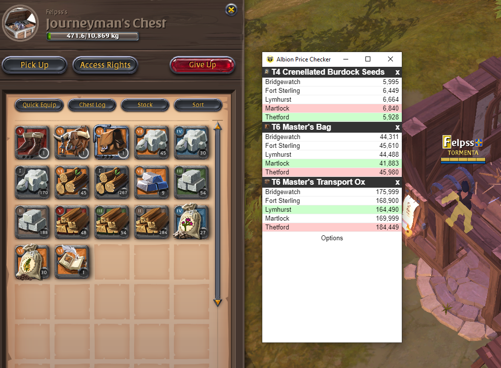

# Albion Price Check
With this tool, you can easily check for albion itens price anywhere you are in the game.

## How it works

1. Inside Albion, press 'Enter' to open the chat.
2. Hold 'Ctrl' and click at the item icon inside your bag or chest, the item will apper at the chat input.
3. Press 'Ctrl + A' to select everything at the chat input.
4. Press 'Ctrl + C' to copy the chat input with the itens to the Clipboard.
5. Press 'Ctrl + Shift + C' to send the Clipboard information to the app, and pop up it.

## This tool does NOT:

- Interact with the game
- Read the game screen
- Read the game packages

## License

MIT

## Disclaimer

ALBION PRICE CHECK ISN´T ENDORSED BY SANDBOX INTERACTIVE GMBH. 

ALBION ONLINE IS A REGISTERED TRADEMARK IN GERMANY, AND/OR OTHER COUNTRIES.
